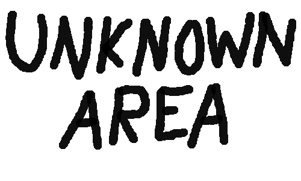
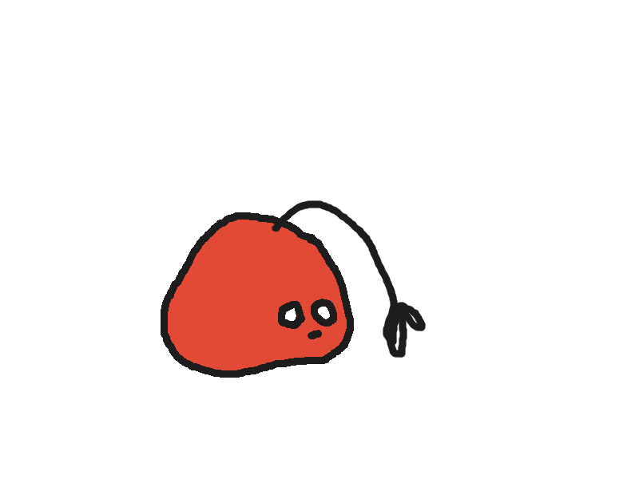
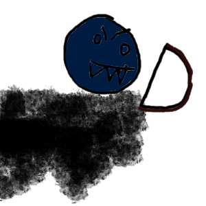

 A small platformer built in 24 hours during the [UCR Rosehack](https://rosehack.com/) 2023 Hackathon. Built by [Seohyeon Lee](https://github.com/seohyeon-lee-2025) and [Moti Urga](https://github.com/mgurga)

## Inspiration
We were influenced by indie adventure games like [Omori](https://www.omori-game.com/) and [Celeste](https://www.celestegame.com/) because of their fascinating worlds. We built the game based on Oesul, Seohyeon's imaginary world [art portfolio] (week1-phi.vercel.app).

## What it does
Unknown area is a game featuring a protagonist running away from a toxic town. The user can use the enter key and direction keys to control the protagonist's movement.

Stories exist as 

## How we built it
We built a game using primarily Javascript (especially Canvas) and HTML. Moti came up with a Javascript-based physics engine to simulate the protagonist's movements. Seohyeon implemented scenes using Javascript and HTML, adapted the storyline to fit the time constraints of a hackathon, and contributed most of the art using GIMP and past concept art. 
 

 

## Challenges we ran into
 We wanted to have a more complex physics engine in the form of Box2D or Matter.JS, but they proved too time consuming to implement. In the end, we chose to build our own simple "physics engine" during the hackathon.

## Accomplishments that we're proud of
We're proud of the story that we adapted to a game during the hackathon. We had to cut most of the settings due to time constraints, but we are glad that we came up with a working product for the first time. 

For Seohyeon, this was their first hackathon and first time making an interactive Javascript website from scratch. 

## What we learned
Seohyeon: building a Javascript website from scratch, animation in Javascript, basic game development, connecting HTML to Javascript, incorporating art and worldbuilding to web development. 

## What's next for Unknown Area
We are planning to incorporate more parts of Seohyeon's world into similar formats and develop new settings inspired by web development. 
